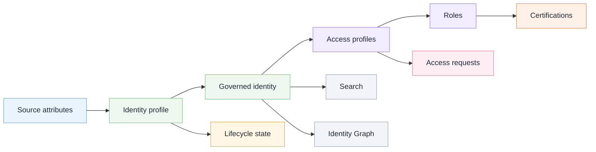

# SailPoint ISC Governance Review Lab

## Overview

This is a public-safe IAM portfolio lab focused on SailPoint Identity Security Cloud governance review concepts.

I created this repo to show how an IAM analyst might review identity profiles, lifecycle states, access profiles, roles, access requests, certifications, Search, and Identity Graph context.

This public version does not include screenshots. It uses written summaries, recreated Mermaid diagrams, fictional scenarios, and sanitized artifacts.

## Fictional scenario

**Northstar Identity Lab** is a fictional organization used for this portfolio project.

In this scenario, Northstar is reviewing how identity data, lifecycle states, and access models support joiner, mover, leaver, access request, and certification review processes.

The review is written from an analyst perspective. It is not a production implementation project.

## What this project proves

This lab demonstrates my ability to review identity governance context, identify access risks, document sanitized findings, and explain how SailPoint ISC governance concepts connect.

The focus is analyst review thinking: what to check, why it matters, and how to document findings safely.

## Governance model at a glance

This diagram shows how identity data, lifecycle state, access requests, roles, certifications, Search, and Identity Graph context connect.

## What the lab demonstrates

| Area                      | What this project shows                                           |
| ------------------------- | ----------------------------------------------------------------- |
| Identity profiles         | How source attributes support governed identities                 |
| Lifecycle states          | How joiner, mover, and leaver events affect access                |
| Attribute mappings        | How identity data supports governance decisions                   |
| Human identities          | How manager, department, and role context support review          |
| Entitlements              | How permissions connect to access profiles                        |
| Access profiles           | How requestable access can be grouped for business use            |
| Roles                     | How access can be reviewed against job or department expectations |
| Access requests           | How request settings affect visibility, approval, and risk        |
| Certifications            | How reviewers use identity and access context                     |
| Search                    | How analysts validate identity and access questions               |
| Identity Graph            | How relationship context supports access review                   |
| Public-safe documentation | How IAM concepts can be documented without tenant data            |

## Skills demonstrated

| Skill                          | Where shown                                 |
| ------------------------------ | ------------------------------------------- |
| IAM governance review          | Analyst review and sanitized findings       |
| Lifecycle access review        | Mover case study and lifecycle flow         |
| Access request analysis        | Access request settings review              |
| Role and access profile review | Access model map and findings               |
| Certification review context   | Certification diagram and GOV-005           |
| Least privilege thinking       | Mover review and stale access risk          |
| Public-safe documentation      | Public safety rules and sanitized artifacts |
| Technical communication        | README, diagrams, findings, and case study  |

## Project files

| File                                                                                   | Purpose                                        |
| -------------------------------------------------------------------------------------- | ---------------------------------------------- |
| [`docs/analyst-review.md`](docs/analyst-review.md)                                     | Analyst review of the governance areas covered |
| [`docs/public-safety.md`](docs/public-safety.md)                                       | Public-safe documentation rules for this repo  |
| [`artifacts/review-findings.md`](artifacts/review-findings.md)                         | Sanitized findings from the fictional review   |
| [`artifacts/mover-review-case-study.md`](artifacts/mover-review-case-study.md)         | Fictional mover review case study              |
| [`diagrams/identity-governance-map.md`](diagrams/identity-governance-map.md)           | Identity governance flow                       |
| [`diagrams/access-model-map.md`](diagrams/access-model-map.md)                         | Access model relationship map                  |
| [`diagrams/lifecycle-review-flow.md`](diagrams/lifecycle-review-flow.md)               | Joiner, mover, and leaver review flow          |
| [`diagrams/analyst-workflow.md`](diagrams/analyst-workflow.md)                         | Analyst workflow for sanitized findings        |
| [`diagrams/certification-review-context.md`](diagrams/certification-review-context.md) | Certification decision context map             |

## Diagrams

| Diagram                      | What it explains                                               |
| ---------------------------- | -------------------------------------------------------------- |
| Identity governance map      | How identity data becomes governance context                   |
| Access model map             | How entitlements, access profiles, roles, and requests connect |
| Lifecycle review flow        | How joiner, mover, and leaver events support access review     |
| Analyst workflow             | How an analyst documents public-safe findings                  |
| Certification review context | What reviewers need before making access decisions             |

## Project boundaries

This is a personal portfolio lab based on SailPoint Identity Security Cloud governance concepts reviewed in a temporary training tenant.

The public version does not include tenant screenshots, internal course instructions, proprietary product content, real employee data, tenant identifiers, IDs, secrets, tokens, API keys, or private training details.

Examples use fictional scenarios, recreated diagrams, written summaries, and sanitized artifacts.

This project demonstrates IAM governance review thinking and safe technical documentation. It does not claim production SailPoint administration experience and is not official SailPoint documentation, training material, implementation guidance, or product advice.

## Scope note

This repo focuses on analyst review thinking: what to check, why it matters, and how to document findings safely.
