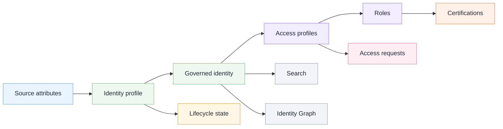

# SailPoint ISC Governance Review Lab

## Overview

This is a public-safe IAM portfolio lab focused on SailPoint Identity Security Cloud governance review concepts.

I created this repo to show how an IAM analyst might review identity governance areas such as identity profiles, lifecycle states, access profiles, roles, access requests, certifications, Search, and Identity Graph context.

This public version does not include screenshots. Instead, it uses written summaries, recreated Mermaid diagrams, fictional scenarios, and sanitized documentation artifacts.

## Fictional scenario

**Northstar Identity Lab** is a fictional organization used for this portfolio project.

In this scenario, Northstar is reviewing how identity data, lifecycle states, and access models support joiner, mover, leaver, access request, and certification review processes.

The review is written from an analyst perspective. It is not a production implementation project.

## Governance model at a glance

I made this diagram to show how I understood the relationship between identity data, lifecycle state, access requests, roles, certifications, Search, and Identity Graph context.

## What the lab demonstrates

| Area                      | What this project shows                                               |
| ------------------------- | --------------------------------------------------------------------- |
| Identity profiles         | How source attributes can support governed identity records           |
| Lifecycle states          | How joiner, mover, and leaver status affects access decisions         |
| Attribute mappings        | How identity attributes can drive governance context                  |
| Human identities          | How analyst review depends on manager, department, and role context   |
| Entitlements              | How low-level permissions connect to access profiles                  |
| Access profiles           | How requestable access can be grouped for business use                |
| Roles                     | How access can be evaluated against job or department expectations    |
| Access requests           | How request settings affect visibility, approval, and risk            |
| Certifications            | How reviewer decisions need identity and access context               |
| Search                    | How analysts can validate identity and access questions               |
| Identity Graph            | How relationship context can support access review decisions          |
| Public-safe documentation | How IAM concepts can be documented without tenant data or screenshots |

## Project files

| File                                       | Purpose                                                                    |
| ------------------------------------------ | -------------------------------------------------------------------------- |
| `docs/analyst-review.md`                   | Short analyst review of the governance areas covered                       |
| `docs/public-safety.md`                    | Public-safe documentation rules used for this repo                         |
| `artifacts/review-findings.md`             | Sanitized sample findings from the fictional review                        |
| `diagrams/identity-governance-map.md`      | Identity governance flow from attributes to review context                 |
| `diagrams/access-model-map.md`             | Access model relationship between entitlements, access profiles, and roles |
| `diagrams/lifecycle-review-flow.md`        | Joiner, mover, and leaver governance flow                                  |
| `diagrams/analyst-workflow.md`             | Analyst workflow for reviewing and publishing sanitized findings           |
| `diagrams/certification-review-context.md` | Certification decision context map                                         |

## Diagrams

| Diagram                      | What it explains                                                         |
| ---------------------------- | ------------------------------------------------------------------------ |
| Identity governance map      | How identity data becomes governance context                             |
| Access model map             | How entitlements, access profiles, roles, and requests connect           |
| Lifecycle review flow        | How joiner, mover, and leaver events can drive access review             |
| Analyst workflow             | How an analyst moves from a governance question to a public-safe finding |
| Certification review context | What reviewers need before approving, revoking, or investigating access  |

## Project boundaries

This is a personal portfolio lab based on SailPoint Identity Security Cloud governance concepts reviewed in a temporary training tenant.

The public version does not include tenant screenshots, internal course instructions, proprietary product content, real employee data, tenant identifiers, IDs, secrets, tokens, API keys, or private training details.

Examples use fictional scenarios, recreated diagrams, written summaries, and sanitized documentation artifacts.

This project demonstrates IAM governance review thinking and safe technical documentation. It does not claim production SailPoint administration experience and is not official SailPoint documentation, training material, implementation guidance, or product advice.

## Scope note

This repo focuses on analyst review thinking: what to check, why it matters, and how to document findings safely.
