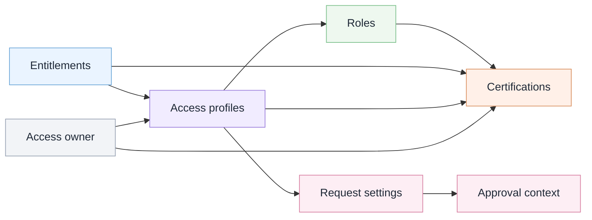

# Access model map

I made this diagram to map the access model from low-level entitlements to request and certification review context.

The scenario uses fictional access examples only.

## Analyst takeaway

Entitlements are the low-level access.

Access profiles make access easier to understand, request, and review.

Roles help compare assigned access against job or department expectations.

Certifications need enough context to decide whether access should stay assigned.
