# Analyst workflow

This diagram shows the review path I would follow before turning a governance observation into a public-safe portfolio note.

The goal is to show the analyst process without exposing tenant details or screenshots.

```mermaid
flowchart LR
    AREA[Pick review area]:::start --> QUESTION[Ask access question]:::question
    QUESTION --> IDCTX[Check identity context]:::identity
    IDCTX --> LCS[Check lifecycle state]:::lifecycle
    LCS --> ACCESS[Review assigned access]:::access
    ACCESS --> REVIEW[Check request or certification context]:::review
    REVIEW --> FINDING[Write finding]:::finding
    FINDING --> SAFETY[Remove private details]:::safety
    SAFETY --> PUBLISH[Publish sanitized note]:::publish

    classDef start fill:#EAF4FF,stroke:#6BA6D8,color:#1F2937;
    classDef question fill:#F2F4F7,stroke:#98A2B3,color:#1F2937;
    classDef identity fill:#EEF8EF,stroke:#7ABF8A,color:#1F2937;
    classDef lifecycle fill:#FFF6E5,stroke:#D6A84F,color:#1F2937;
    classDef access fill:#F1ECFF,stroke:#9B7EDC,color:#1F2937;
    classDef review fill:#FFF0E8,stroke:#D9905F,color:#1F2937;
    classDef finding fill:#FDEEF4,stroke:#D77FA1,color:#1F2937;
    classDef safety fill:#EEF2FF,stroke:#818CF8,color:#1F2937;
    classDef publish fill:#ECFDF3,stroke:#12B76A,color:#1F2937;
```

## Analyst takeaway

A useful portfolio artifact should show the review question, the context checked, the finding, and the safe version of the evidence.

The public version should explain the thinking without exposing private tenant details.
