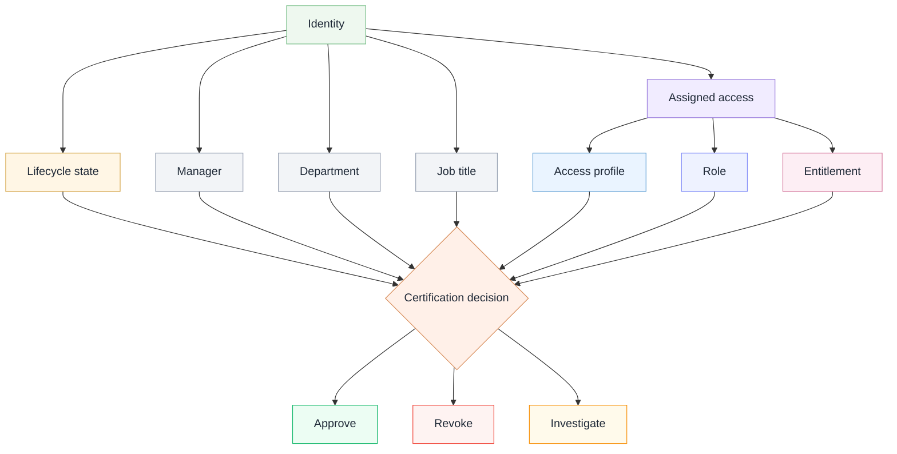

# Certification review context

I made this diagram to show the context a reviewer may need before approving, revoking, or investigating access.

The scenario uses fictional examples only.

## Analyst takeaway

Certification review should not be a blind approval exercise.

Reviewers need identity context, lifecycle state, business context, and access details before deciding whether to approve, revoke, or investigate access.
