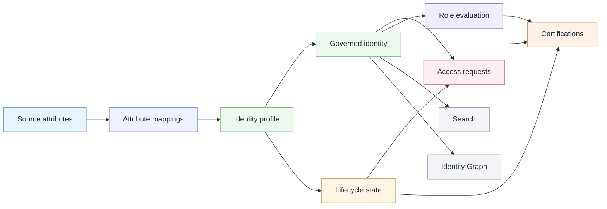

# Identity governance map

I made this diagram to show how I understood the relationship between identity data, lifecycle state, access review, and investigation context.

The scenario uses the fictional **Northstar Identity Lab** organization.

## Analyst takeaway

Identity governance starts with usable identity data.

If source attributes and mappings are unclear, it becomes harder to trust lifecycle decisions, access requests, role evaluation, and certification reviews.
