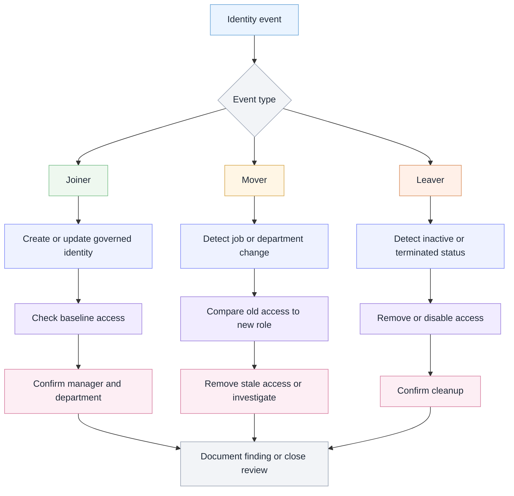

# Lifecycle review flow

I used this flow to think through how joiner, mover, and leaver events can affect access review.

The scenario uses fictional examples only.

## Analyst takeaway

Joiner, mover, and leaver review should focus on whether access matches the identity’s current business need.

Mover and leaver scenarios usually need extra attention because stale access can remain after role or employment changes.
